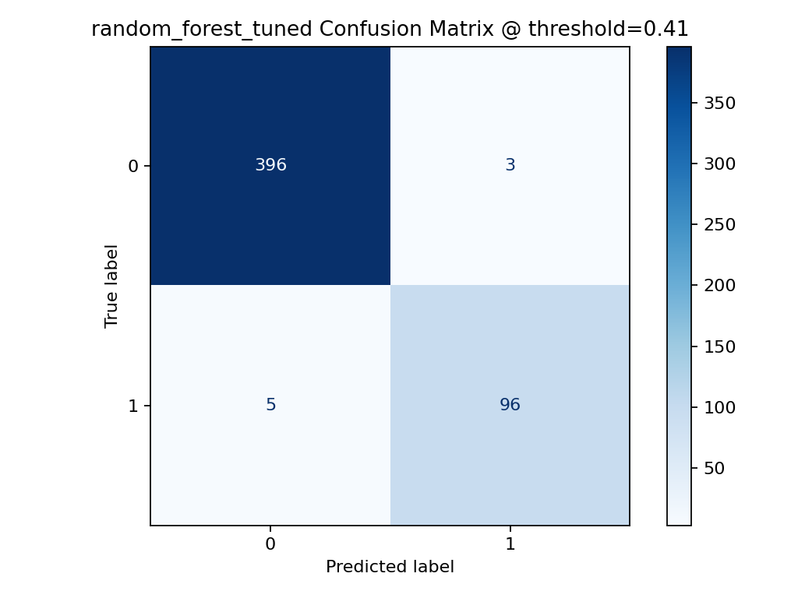
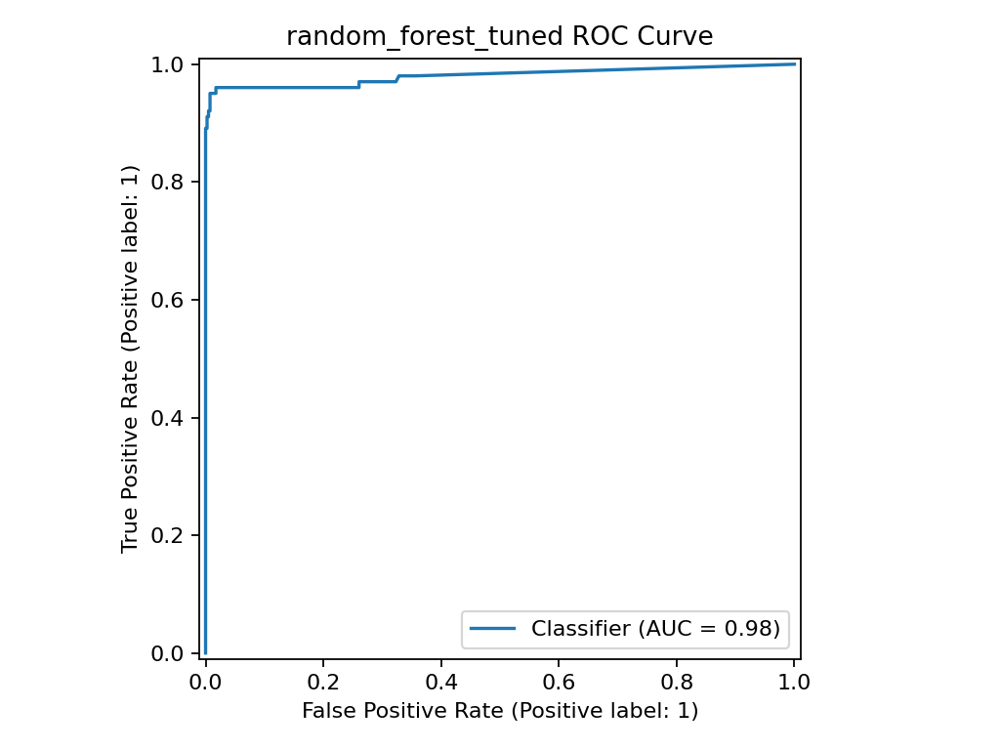
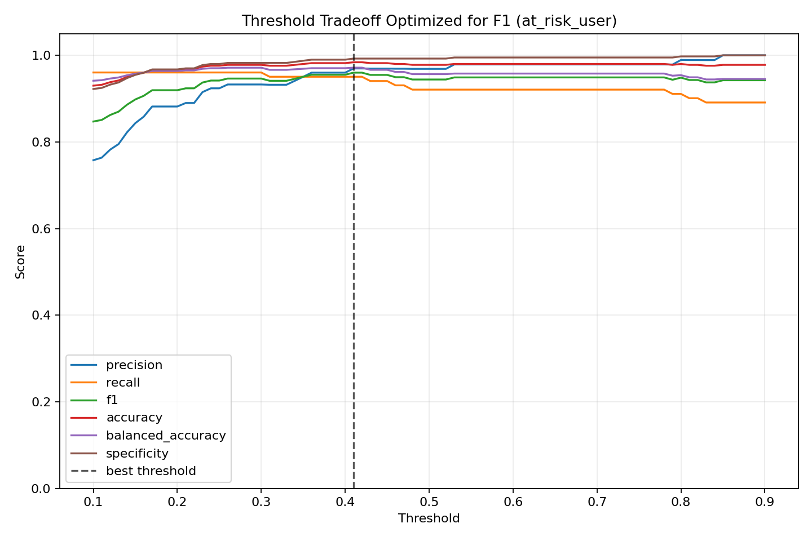
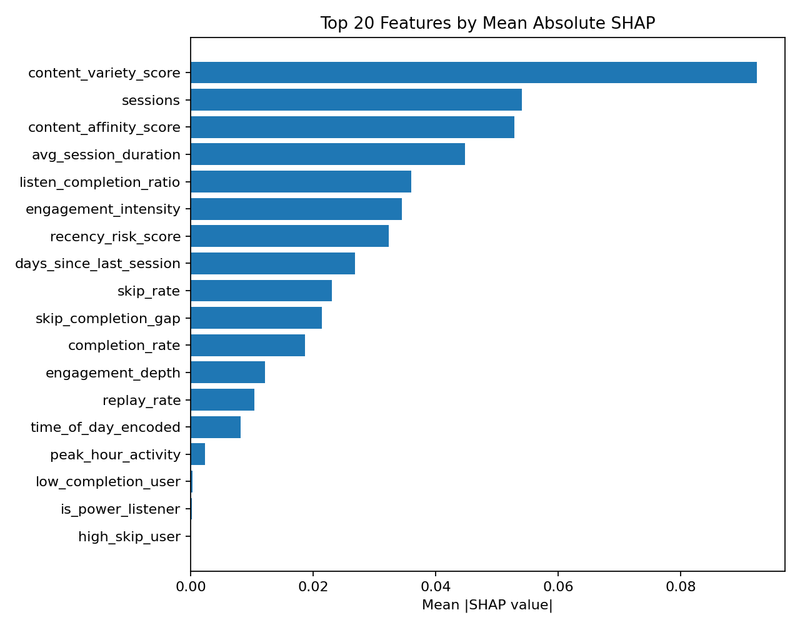

# Podcast Listener Engagement & At-Risk Retention Prediction

End-to-end ML pipeline untuk mendeteksi listener yang berisiko churn pada audio streaming platform, menggunakan calibrated synthetic behavioral data yang divalidasi terhadap Last.fm HetRec 2011 sebagai public listening-behavior proxy.

## 📌 Problem Statement

Simulates an ML pipeline for predicting listener engagement on an audio streaming platform, inspired by use cases at platforms like Noice. Uses behavioral signals — completion rate, skip rate, creator affinity, content type — to identify listeners at risk of disengagement.

**Data disclaimer:** Uses synthetic behavioral data designed to mimic audio streaming listener patterns. The DataConnector supports replacing synthetic data with real CSV, PostgreSQL, or BigQuery sources.

## 🎯 Objectives

- Define meaningful engagement signals from raw user interaction data
- Build and compare classification models to predict churn/disengagement
- Identify the most influential features driving user drop-off
- Provide actionable insights for retention strategy

## 🗂️ Project Structure

```text
user-engagement-prediction/
├── data/
│   ├── raw/
│   ├── processed/
│   └── generate_synthetic_data.py
├── notebooks/
│   ├── 01_eda.ipynb
│   ├── 02_feature_engineering.ipynb
│   ├── 03_modeling.ipynb
│   └── 04_evaluation.ipynb
├── src/
│   ├── data_pipeline.py
│   ├── feature_engineering.py
│   ├── train.py
│   ├── evaluate.py
│   └── utils.py
├── experiments/
│   └── experiment_log.md
├── requirements.txt
├── .gitignore
└── README.md
```

## 🧠 Targets

This project supports two related targets:

| Target | Purpose | Recommended Use |
|---|---|---|
| `returned_within_7_days` | Retention likelihood signal | Behavioral analysis / retention probability |
| `at_risk_user` | Business intervention target | Main portfolio model for churn prevention |

The recommended portfolio model is the Tuned Random Forest trained on `at_risk_user`, because it directly supports retention intervention decisions and meaningfully outperforms dummy baselines.

## 🔧 Features

| Feature | Description |
|---|---|
| `avg_session_duration` | Average listening/watching time per session |
| `skip_rate` | Ratio of skipped content to total content started |
| `replay_rate` | Frequency of replayed segments |
| `content_variety_score` | Number of unique genres/creators consumed |
| `days_since_last_session` | Recency of last platform interaction |
| `completion_rate` | Average percentage of content completed per session |
| `peak_hour_activity` | Whether user is most active in peak hours |

## ⚙️ Setup

```bash
python -m venv venv
source venv/bin/activate
pip install -r requirements.txt
```


### macOS Boosting Dependency

XGBoost and LightGBM may require OpenMP on macOS. If `libomp.dylib` is missing, install it with:

```bash
brew install libomp
```

The rest of the pipeline can still run with Logistic Regression or Random Forest if XGBoost is unavailable.

## 🚀 Running the Pipeline

```bash
python data/generate_synthetic_data.py
python src/data_pipeline.py
python src/feature_engineering.py
python src/train.py --model xgboost
python src/evaluate.py --model xgboost
```

Available model names:

- `logistic_regression`
- `random_forest`
- `xgboost`
- `lightgbm`


## 🎚️ Threshold Calibration

Calibrate the classification threshold after tuning and selecting the best model:

```bash
python src/calibrate_threshold.py --metric f1
```

Supported metrics are `f1`, `recall`, and `precision`. Outputs are saved to:

- `reports/threshold_metrics.csv`
- `reports/figures/threshold_tradeoff.png`
- `experiments/best_threshold.json`

## 🧪 MLflow Tracking

Training and tuning scripts log parameters, metrics, models, and artifacts to MLflow when `mlflow` is installed.

```bash
mlflow ui
```

Then open `http://127.0.0.1:5000` to inspect experiment runs.

## 📊 Evaluation Metrics

| Metric | Why It Matters |
|---|---|
| ROC-AUC | Overall model discrimination ability |
| Precision | Avoid false alarms and unnecessary notifications |
| Recall | Catch as many at-risk users as possible |
| F1-Score | Balance precision and recall |


## ✅ Latest Smoke Test Metrics

| Model | ROC-AUC | Precision | Recall | F1-Score | Notes |
|---|---:|---:|---:|---:|---|
| Logistic Regression | 0.8750 | 0.9973 | 0.7399 | 0.8495 | Retrained after synthetic calibration |
| Random Forest | 0.5348 | 0.9920 | 1.0000 | 0.9960 | High-recall baseline on calibrated data |
| Tuned Random Forest | 0.6915 | 0.9920 | 1.0000 | 0.9960 | 50 Optuna trials |

## 🏁 Final Results

The final recommended model is a Tuned Random Forest trained on the `at_risk_user` business target. The original `returned_within_7_days` target is retained as a retention-likelihood signal, but it is not used as the main portfolio target because it is 99.28% positive after calibration.

Target distribution for `at_risk_user`:

| Class | Meaning | Rows | Percentage |
|---|---|---:|---:|
| 0 | Not currently at risk | 1,993 | 79.72% |
| 1 | At-risk listener | 507 | 20.28% |

Final model metrics:

| Metric | Tuned Random Forest |
|---|---:|
| ROC-AUC | 0.9803 |
| PR-AUC | 0.9715 |
| Precision | 0.9697 |
| Recall | 0.9505 |
| F1-Score | 0.9600 |
| Balanced Accuracy | 0.9715 |
| Specificity | 0.9925 |
| Best threshold | 0.41 |

Confusion matrix summary:

| Actual / Predicted | Predicted Not Risk | Predicted At Risk |
|---|---:|---:|
| Actual Not Risk | 396 | 3 |
| Actual At Risk | 5 | 96 |

From 101 at-risk listeners in the test set, the model catches 96 and misses 5. False positives are also low: only 3 non-risk listeners are incorrectly flagged as at-risk.

Dummy baseline comparison:

| Model | F1 | ROC-AUC | PR-AUC |
|---|---:|---:|---:|
| Most Frequent Dummy | 0.0000 | 0.5000 | 0.2020 |
| Constant Positive Dummy | 0.3361 | 0.5000 | 0.2020 |
| Tuned Random Forest | 0.9600 | 0.9803 | 0.9715 |

The at-risk listener model meaningfully outperformed dummy baselines across ROC-AUC, PR-AUC, F1-score, balanced accuracy, and specificity. Unlike the original retention-likelihood target, this business-focused target provides a more reliable evaluation setup for churn-prevention use cases.

Caveat: this project does not use Noice production data. It uses synthetic listener behavior calibrated and validated against Last.fm HetRec 2011 as a public listening-behavior proxy.


## ⚠️ Evaluation Caveat

The calibrated `returned_within_7_days` target is highly imbalanced: 99.28% of rows are positive and only 0.72% are negative. This means F1, recall, precision, and accuracy can look very high even when the model does not identify the minority non-returning listeners.

Dummy baseline diagnostics confirm this risk:

| Model | Accuracy | Precision | Recall | F1 | ROC-AUC | PR-AUC | Balanced Accuracy | Specificity |
|---|---:|---:|---:|---:|---:|---:|---:|---:|
| Tuned/Calibrated Random Forest | 0.9920 | 0.9920 | 1.0000 | 0.9960 | 0.5348 | 0.9945 | 0.5000 | 0.0000 |
| Most Frequent Dummy | 0.9920 | 0.9920 | 1.0000 | 0.9960 | 0.5000 | 0.9920 | 0.5000 | 0.0000 |
| Constant Positive Dummy | 0.9920 | 0.9920 | 1.0000 | 0.9960 | 0.5000 | 0.9920 | 0.5000 | 0.0000 |

Interpretation: Random Forest slightly improves ranking metrics over dummy baselines, but does **not** meaningfully detect the negative class under the current target definition (`specificity=0.0`). Logistic Regression is stronger by ROC-AUC (`0.8750`) and balanced accuracy (`0.7450`), while Random Forest is useful only for high-recall positive-return scoring.

Recommendation: keep `returned_within_7_days` for retention-likelihood scoring, but use the optional `at_risk_user` target for a more business-focused churn-risk model. The optional target can be generated with:

```bash
python src/create_risk_target.py
```

Generated diagnostics:

- `reports/target_distribution.csv`
- `reports/figures/target_distribution.png`
- `reports/baseline_diagnostics.csv`
- `data/processed/engagement_features_with_risk_target.csv`


## 🎯 Business Target Experiment: At-Risk Listener Prediction

The original `returned_within_7_days` label remains useful as a retention-likelihood signal, but it became too positive-heavy after calibration for churn/risk detection. Only 0.72% of rows were non-returning listeners, so a constant-positive dummy baseline matched the Random Forest F1-score.

For retention intervention, the project adds an optional business target: `at_risk_user`. This target identifies listeners who may need recommendation nudges, notifications, or re-engagement campaigns. The main pipeline is preserved; this experiment writes separate `risk_*` artifacts and reports.

Definition:

```text
at_risk_user = 1 when:
  returned_within_7_days == 0
  OR days_since_last_session > 7 AND completion_rate < 0.80
  OR skip_rate > 0.25 AND completion_rate < 0.75
```

Target distribution:

| Class | Meaning | Rows | Percentage |
|---|---|---:|---:|
| 0 | Not currently at risk | 1,993 | 79.72% |
| 1 | At-risk listener | 507 | 20.28% |

Risk model comparison:

| Model | ROC-AUC | PR-AUC | Precision | Recall | F1 | Balanced Accuracy | Specificity |
|---|---:|---:|---:|---:|---:|---:|---:|
| Tuned Random Forest | 0.9803 | 0.9715 | 0.9697 | 0.9505 | 0.9600 | 0.9715 | 0.9925 |
| Random Forest | 0.9753 | 0.9703 | 0.9894 | 0.9208 | 0.9538 | 0.9591 | 0.9975 |
| Logistic Regression | 0.9476 | 0.8832 | 0.7480 | 0.9406 | 0.8333 | 0.9302 | 0.9198 |

Dummy baseline comparison:

| Model | ROC-AUC | PR-AUC | F1 | Balanced Accuracy | Specificity |
|---|---:|---:|---:|---:|---:|
| Tuned Random Forest, calibrated threshold 0.41 | 0.9803 | 0.9715 | 0.9600 | 0.9715 | 0.9925 |
| Most Frequent Dummy | 0.5000 | 0.2020 | 0.0000 | 0.5000 | 1.0000 |
| Stratified Dummy | 0.4528 | 0.1921 | 0.1346 | 0.4528 | 0.7669 |
| Constant Positive Dummy | 0.5000 | 0.2020 | 0.3361 | 0.5000 | 0.0000 |

Final recommendation: use `returned_within_7_days` for retention-likelihood scoring, but use `at_risk_user` as the primary portfolio/business intervention target because it directly answers: “Which listeners should receive retention actions before they churn?”

Risk experiment artifacts:

- `data/processed/engagement_features_with_risk_target.csv`
- `reports/risk_target_distribution.csv`
- `reports/figures/risk_target_distribution.png`
- `reports/risk_model_comparison.csv`
- `reports/risk_baseline_diagnostics.csv`
- `reports/risk_threshold_metrics.csv`
- `reports/figures/risk_threshold_tradeoff.png`
- `reports/figures/risk_confusion_matrix.png`
- `reports/figures/risk_roc_curve.png`


## 📸 Portfolio Screenshots

These generated reports make the project easier to review visually:

| Risk Confusion Matrix | Risk ROC Curve |
|---|---|
|  |  |

| Threshold Tradeoff | SHAP Top Features |
|---|---|
|  |  |

Key HTML reports:

- `reports/model_comparison.html`
- `reports/risk_model_comparison.html`
- `reports/external_validation/lastfm_report.html`

Note: raw Last.fm dataset files are intentionally excluded from Git because they are large public external data files.

## 🔍 Key Insights to Validate

- Skip rate is expected to be a strong predictor of disengagement.
- Replay rate is expected to be a positive engagement signal.
- Users inactive for more than five days may show higher churn probability.
- Low completion rate should consistently flag at-risk users.


## 🌐 Prediction API

Run the FastAPI service locally:

```bash
uvicorn api.app:app --reload --port 8000
```

Score the sample request:

```bash
curl -X POST http://127.0.0.1:8000/predict \
  -H "Content-Type: application/json" \
  --data @api/sample_request.json
```

The API defaults to `experiments/risk_best_model.pkl` and returns `risk_probability`, `threshold`, `predicted_at_risk`, `risk_segment`, and `recommended_action`. If the risk model is unavailable, it falls back to the legacy retention-likelihood model.

### Docker

```bash
docker compose up --build
```

The API is available at `http://127.0.0.1:8000`.

## 💡 Business Implications

| Finding | Recommended Action |
|---|---|
| High skip rate users | Trigger content re-recommendation after repeated skips |
| Low completion rate | Surface shorter-form content to re-engage |
| 5+ day inactivity | Send personalized push notification with new content |
| Low content variety | Introduce content from adjacent genres |

## 🛣️ Roadmap

- [x] Synthetic listener behavior data generation
- [x] Data preprocessing and feature engineering pipeline
- [x] External validation using Last.fm HetRec 2011
- [x] Synthetic data calibration using PSI and KS-test
- [x] Baseline and tuned model training
- [x] Imbalance-aware evaluation and dummy baseline comparison
- [x] Business-focused `at_risk_user` target
- [x] Threshold calibration
- [x] SHAP feature importance report
- [x] FastAPI risk scoring endpoint
- [x] Docker support
- [ ] A/B test simulation for intervention strategy
- [ ] Real production data integration

A/B test simulation is kept as future work because the current implementation focuses on data validation, risk modeling, explainability, API inference, and deployment packaging.

## Project Summary

This project builds an end-to-end machine learning pipeline for identifying audio listeners who may be at risk of disengagement or churn.

The pipeline starts with synthetic listener behavior data, then validates and calibrates part of its behavioral distribution using the Last.fm HetRec 2011 public dataset as a listening-behavior proxy. The project does not use internal Noice data.

The initial retention-likelihood target, `returned_within_7_days`, was useful for behavior analysis but became highly positive-heavy after calibration. To make the modeling task more useful for retention intervention, the project introduces a business-focused target: `at_risk_user`.

The final recommended model is a Tuned Random Forest trained on `at_risk_user`. It is evaluated with imbalance-aware metrics, dummy baseline comparison, threshold calibration, and explainability reports.

Final at-risk model results:

| Metric | Score |
|---|---:|
| ROC-AUC | 0.9803 |
| PR-AUC | 0.9715 |
| Precision | 0.9697 |
| Recall | 0.9505 |
| F1-Score | 0.9600 |
| Balanced Accuracy | 0.9715 |
| Specificity | 0.9925 |
| Threshold | 0.41 |

The model is exposed through a FastAPI endpoint that returns a risk probability, risk segment, and recommended intervention action.

## 👤 Author

**Luthfi Mirza Darsono**  
Gunadarma University — Information Systems  
📧 luthfimirza2004@gmail.com

## 📄 License

This project is licensed under the MIT License.

## 🧭 Production Architecture

```text
Raw Data
  ↓
Connector
  ↓
Pipeline
  ↓
Train
  ↓
Tune
  ↓
Calibrate
  ↓
Model
  ↓
API
  ├─ /predict
  ├─ /batch-predict
  ├─ /health
  └─ /metrics
  ↓
Drift Monitor
  ↓
Retrain Trigger
  ↓
Dashboard
```

## ⚡ Quickstart: Clone to First Prediction

```bash
pip install -r requirements.txt
make data
make train TRIALS=1
make api
curl -X POST http://127.0.0.1:8000/v1/predict -H "Content-Type: application/json" --data @api/sample_request.json
```

For a non-executing preview of the training pipeline:

```bash
make train DRY=1 TRIALS=1
```

## 🧪 Testing

Run the unit test suite with coverage:

```bash
make test
```

Equivalent command:

```bash
pytest --cov=src --cov=api --cov-report=term-missing
```

## 🪪 Model Card

### Intended Use

Predict whether streaming users are likely to remain engaged or become at risk, enabling retention workflows such as recommendations, nudges, and reactivation campaigns.

### Training Data

The current model is trained on simulated user interaction data generated by `data/generate_synthetic_data.py`. The main processed training dataset is `data/processed/engagement_features.csv`.

### Feature List

- `sessions`
- `avg_session_duration`
- `skip_rate`
- `replay_rate`
- `content_variety_score`
- `days_since_last_session`
- `completion_rate`
- `peak_hour_activity`
- `engagement_intensity`
- `skip_completion_gap`
- `recency_risk_score`
- `high_skip_user`
- `low_completion_user`

### Performance Metrics

| Metric | Value |
|---|---:|
| ROC-AUC | 0.9803 |
| PR-AUC | 0.9715 |
| F1 | 0.9600 |
| Recall | 0.9505 |
| Precision | 0.9697 |
| Balanced Accuracy | 0.9715 |
| Specificity | 0.9925 |
| Threshold | 0.41 |

## Limitations

This project is a portfolio simulation and does not use production data from Noice or any other streaming platform.

Last.fm HetRec 2011 is used only as a public behavioral proxy to improve the realism of synthetic data distributions. It does not contain native podcast-specific signals such as skip events, episode completion, premium content behavior, notification exposure, or platform-specific session semantics.

The `at_risk_user` target is rule-assisted and should be recalibrated with real product labels before any production use. A/B test simulation remains future work; the current implementation focuses on data validation, risk modeling, explainability, API inference, and deployment packaging.

## 🛠️ Troubleshooting

### XGBoost or LightGBM fails on macOS

Install OpenMP:

```bash
brew install libomp
```

### PyArrow CPU warnings

Some sandboxed macOS environments emit `sysctlbyname` warnings from PyArrow. These are usually non-fatal and do not block the pipeline.

### API port conflict

If port `8000` is already in use, run:

```bash
uvicorn api.app:app --reload --port 8001
```

### Reproducibility

Training and tuning accept a seed:

```bash
python src/train.py --model random_forest --seed 42
python src/tune.py --model random_forest --trials 50 --seed 42
```

A frozen environment snapshot is stored in `experiments/requirements_lock.txt`.

## 📚 Data Sources & External Validation

This project does **not** use real Noice user data. It uses synthetic listener behavior data designed to mimic audio streaming patterns such as completion rate, skip rate, creator affinity, content type, listening time, and 7-day return behavior.

Synthetic behavioral data was calibrated using the public Last.fm HetRec 2011 dataset as a listening-behavior proxy. This is an external realism check, not a claim that Last.fm represents Noice users or podcast listeners exactly.

Latest validation results after calibration:

| Metric | Value |
|---|---:|
| Synthetic rows | 2,500 |
| Last.fm proxy rows | 500 |
| Median PSI | 0.8247 |
| Features with PSI < 0.1 | 8 |

Some interaction features such as time-of-day activity, sharing/commenting proxies, `returned_within_7_days`, and `peak_hour_activity` showed low PSI similarity. Retention and intensity features still differ because Last.fm does not contain native podcast completion, skip behavior, premium content, or Noice-specific session semantics. Remaining high-PSI features are documented as calibration opportunities rather than hidden assumptions.

Validation artifacts:

- `reports/external_validation/lastfm_profile.json`
- `data/external/lastfm_features.csv`
- `reports/external_validation/synthetic_vs_lastfm.csv`
- `reports/external_validation/lastfm_report.html`

Citation:

Cantador, I., Brusilovsky, P., Kuflik, T. (2011). 2nd Workshop on Information Heterogeneity and Fusion in Recommender Systems. RecSys 2011.
